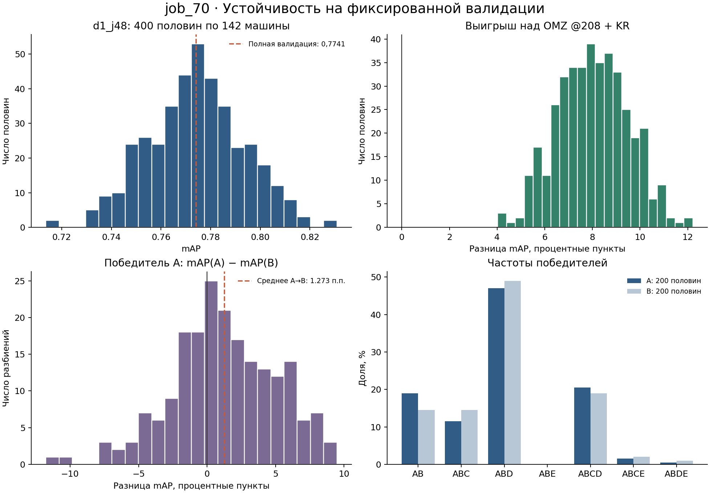
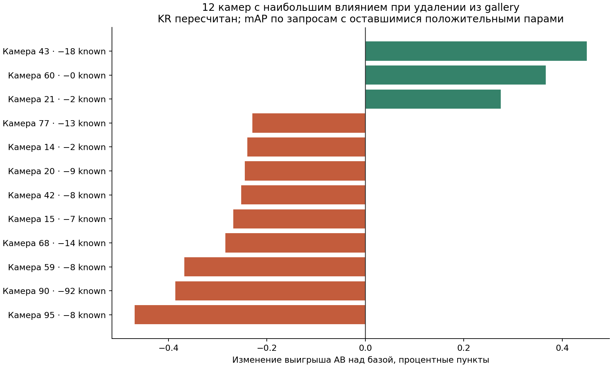

# job_70 — устойчивость результата и оптимизм выбора

Завершено 21 сентября 2026 года. Все вычисления выполнены на `worker-vm` (`sespel-worker.local`), NumPy 2.4.6. Сдаваемая конфигурация не изменялась; обучение, подбор параметров, commit и push не выполнялись.

**Главное число по формуле задания: оптимизм выбора A→B = 0,012732240 mAP, или 1,273 процентного пункта.** Победитель A перестал быть лучшим на B в 188/200 разбиениях (94,0%).

Для интерпретации существенно, что обратное направление даёт 0,001071960, а среднее обоих направлений — **0,006902100**. Устойчивый выигрыш над базой и точный порядок близких ансамблей — разные результаты: выигрыш положителен в 400/400 половинах и 87/87 исключениях камер, а лидерство AB на случайной половине сохраняется лишь в 16,75% случаев.

## 1. Контрольная точка и протокол

| Проверка | Получено |
|---|---:|
| d1_j48 / AB: mAP | **0,7740915539438481** |
| d1_j48 / AB: Rank-1 | **0,7307692307692307** |
| База OMZ OSNet-AIN @208 без whitening, с KR: mAP | **0,6936584724586873** |
| Выигрыш AB над базой | **+0,0804330814851608** |
| Исходные query / gallery / known query | 1110 / 750 / 832 |
| Машины среди known query / машины в каждой половине | 284 / 142 |
| Запросы в половине: медиана; min–max | 416; 389–443 |

Контроль выполнен **первым**, повторным KR(6,3,0.3) из сохранённых AB-векторов, затем неизменённым `04-solution/eval/reid_metrics.py`. Совпадают `float.hex()` обеих метрик и байты AP/Rank-1 каждого known-запроса с `job_48`. mAP: `0x1.8c55ba6898e85p-1`; Rank-1: `0x1.7627627627627p-1`. [Машинная проверка](out/checkpoint.json).

Протокол: full-gallery mAP, `camera_policy="market"` (исключение same-ID AND same-camera), `ap_method="step"`, усреднение по valid/known query. Исходные 278 unknown-запросов не включены в знаменатель 832. Это не mAP@10 и не усреднение по всем 1110 запросам.

Основное семейство зафиксировано до получения статистики: семь сохранённых ансамблей с whitening и пять одиночных ветвей; у каждого cosine и KR(6,3,0.3), всего **24 варианта**. Новые whitening-матрицы, веса и конфигурации не создавались. A = OMZ @208; B = job_48 @208; C = обученная job_68 @256; D = OMZ @256; E = прежняя combined_v1 @256.

| Конфигурация | mAP cosine | mAP KR | Rank-1 KR |
|---|---:|---:|---:|
| AB = d1_j48 | 0,731609 | 0,774092 | 0,730769 |
| ABC | 0,737008 | 0,774196 | 0,736779 |
| ABD | 0,731950 | 0,777874 | 0,739183 |
| ABE | 0,734796 | 0,768077 | 0,725962 |
| ABCD | 0,740589 | 0,776369 | 0,735577 |
| ABCE | 0,733151 | 0,767422 | 0,725962 |
| ABDE | 0,736838 | 0,771792 | 0,731971 |
| A | 0,656569 | 0,693658 | 0,663462 |
| B | 0,713541 | 0,742329 | 0,695913 |
| C | 0,704216 | 0,725580 | 0,676683 |
| D | 0,649716 | 0,691189 | 0,667067 |
| E | 0,692449 | 0,724218 | 0,679087 |

Разбиения: 200 различных seed из `default_rng(20260921)` / PCG64; внутри каждого seed переставляются отсортированные known `vehicle_id`, по 142 ID в A и B. Кадры одной машины никогда не попадают в обе половины. Метрика сохраняет вес каждого запроса, а не усредняет машины поровну. [Seeds и размеры](out/seeds.csv), [полный состав половин](out/splits.json), [все 9600 метрик](out/half_metrics.csv).

В основном анализе фиксированы gallery и весь пул векторов query, участвующий в трансдуктивном KR; разделяются **метки оцениваемых запросов**. AP получены штатным оценщиком, усреднение половин выполняет его собственная `_aggregate_ranking`, без реализации новой метрики. Для 48 контрольных половин прямой вызов публичного оценщика совпал побитово. Модели, whitening и контекст KR уже сформированы до разбиения: это условная оценка на имеющемся наборе, а не полное вложенное обучение и не новая независимая галерея.

## 2. Разброс mAP d1_j48

| Статистика по 400 половинам | mAP |
|---|---:|
| Медиана | 0,774092 |
| Среднее | 0,774060 |
| Стандартное отклонение | 0,019214 |
| Q25–Q75 | [0,762170; 0,786252] |
| Ширина IQR | 0,024081 |
| Центральные 95% половин | [0,737940; 0,810237] |
| Полный min–max | [0,713621; 0,830897] |

Ответ на «±сколько»: **примерно ±0,0192 mAP по одному SD**; центральные 95% наблюдавшихся половин лежат в [0,7379; 0,8102], приблизительно ±0,036 около 0,774. В крайних случаях отклонение вниз достигло 0,0605, вверх — 0,0568.

Медиана абсолютного разрыва между двумя половинами одного разбиения — 0,024420, максимальный разрыв — 0,117275. Это эмпирический разброс подвыборок существующих 284 машин: он не является 95% прогнозным интервалом для закрытого теста. Половины одного разбиения комплементарны, разбиения перекрываются; 400 половин не равны 400 независимым датасетам.



## 3. Оптимизм отбора

На каждом split выбран `c_A = argmax_c mAP_A(c)`; требуемая величина — среднее `mAP_A(c_A) − mAP_B(c_A)`. При точном равенстве действует фиксированный порядок конфигураций; в основном семействе равных первых мест не было.

| Величина | Значение |
|---|---:|
| Средний оптимизм A→B | 0,012732240 |
| SD разницы A−B | 0,038189 |
| Медиана разницы | 0,011504 |
| Q25–Q75 | [-0,011515; 0,040951] |
| Центральные 95% разниц | [-0,067040; 0,083073] |
| Полный диапазон разниц | [-0,117631; 0,094768] |
| Средняя mAP победителя на A | 0,782559 |
| Средняя mAP этого же варианта на B | 0,769827 |
| Средний / медианный ранг на B | 3,835 / 4 |
| Среднее отставание от лучшего на B | 0,006905 |

Ранги выбранного на A варианта на B (ранг: число разбиений): 1: 12, 2: 35, 3: 47, 4: 32, 5: 42, 6: 18, 7: 14. Только 12/200 победителей сохранили первое место; 188/200 (94%) его потеряли. [Все выборы и проверки на B](out/all24_selection.csv).

**Эффект ориентации половин.** У фиксированного AB, который заново вообще не выбирали, средняя mAP(A)−mAP(B) уже равна +0,006246114. Поэтому все 0,012732 нельзя приписывать только выбору: случайные A в этих 200 seed оказались в среднем легче. После вычитания разрыва фиксированного AB остаётся 0,006486127; симметричное правило выбора A→B и B→A даёт 0,006902100 (SD между разбиениями 0,003725). Seeds сохранены без перебора и замены. Симметризация устраняет произвольность названия половин, но не прошлое использование валидации.

| Охват вариантов | A→B | B→A | Среднее двух направлений | Победитель A не лучший на B |
|---|---:|---:|---:|---:|
| 7 ансамблей, KR | 0,012732 | 0,001072 | 0,006902 | 188/200 |
| 24 варианта: ансамбли и одиночные, KR/cosine | 0,012732 | 0,001072 | 0,006902 | 188/200 |
| 45 уникальных AP из расширенного архива | 0,013298 | 0,002458 | 0,007878 | 190/200 |

Расширенный архив содержит **63 записи / 45 уникальных векторов AP**: основное семейство плюс все сохранённые full-gallery AP из `job_42/out/perquery_step{0,1,2}.npz`, `job_48/out/s02_perquery_j48.npz` и пяти исходных результатов `job_68/eval`. Точные дубликаты AP объединены с сохранением алиасов; top-k и plate-абляции не смешиваются с целевой метрикой. Вектор признаков для этих дополнительных вариантов заново не подбирался. [Состав, алиасы и результаты](out/history_results.json), [выборы по каждому split](out/history_selection.csv). Это всё ещё не вся история десятков заданий и не гарантированная нижняя граница её подгонки.

Эти числа описывают **правило выбора максимума среди зафиксированных кандидатов**. В самом семействе AB не лучший по полной валидации: выше ABD, ABCD и ABC. Поэтому вычитать 0,01273 или 0,00690 из 0,77409 и объявлять остаток «истинной mAP d1_j48» некорректно. Исторический выбор модели, рецепта обучения и самого набора кандидатов уже зависел от этой валидации.

## 4. Кто выигрывает на половинах

| Ансамбль с KR | mAP на всей валидации | Побед на A, из 200 | Побед на B, из 200 | Доля среди 400 половин |
|---|---:|---:|---:|---:|
| AB / d1_j48 | 0,774092 | 38 (19,0%) | 29 (14,5%) | 16,75% |
| ABC | 0,774196 | 23 (11,5%) | 29 (14,5%) | 13,00% |
| ABD | 0,777874 | 94 (47,0%) | 98 (49,0%) | 48,00% |
| ABE | 0,768077 | 0 (0,0%) | 0 (0,0%) | 0,00% |
| ABCD | 0,776369 | 41 (20,5%) | 38 (19,0%) | 19,75% |
| ABCE | 0,767422 | 3 (1,5%) | 4 (2,0%) | 1,75% |
| ABDE | 0,771792 | 1 (0,5%) | 2 (1,0%) | 0,75% |

AB не хуже всех остальных в **38/200 A (19%)**, **29/200 B (14,5%)**, суммарно **67/400 (16,75%)**. ABD выигрывает в **94/200 A (47%)**, **98/200 B (49%)**, суммарно **192/400 (48%)**. Остальные 17 вариантов основного семейства, включая все одиночные модели и cosine, не выиграли ни одной половины; выборы в семействах 7 и 24 полностью совпали.

Средняя Spearman-корреляция рангов семи ансамблей между A и B — **0,235**, медиана 0,286, диапазон [-0,786; 0,964]. Для всех 24 она выше (0,916) благодаря стабильно слабым вариантам; это не делает порядок лидеров устойчивым. Частота побед ABD сама по себе не доказывает значимое превосходство на независимом тесте.

В расширенном архиве AB выиграл 65/400 половин (16,25%), ABD — 185/400 (46,25%); дополнительно 15 половин выиграл прежний `trained_d1_256`, одну — `job48:c3`. Выбор сдаваемого AB не изменён.

## 5. Насколько устойчив выигрыш над базой

На всей валидации: 0,774091554 − 0,693658472 = **+0,080433081 mAP**. Выигрыш считается парно: обе модели оцениваются на одних запросах и одной gallery.

| Выигрыш на половинах | Разница mAP |
|---|---:|
| Медиана | 0,080434 |
| Среднее | 0,080450 |
| SD | 0,014740 |
| Q25–Q75 | [0,069970; 0,090780] |
| Центральные 95% | [0,052679; 0,108742] |
| Полный min–max | [0,040258; 0,122184] |

**Схлопывания выигрыша до нуля нет: 0/400.** Худшая половина всё ещё даёт +0,040258; половин с выигрышем ниже половины полного эффекта — 0/400. Это существенно устойчивее, чем различия между близкими ансамблями.

Дополнительный парный bootstrap по vehicle_id (4000 выборок с возвращением, seed=20260922) дал 95% percentile-интервал выигрыша **[0,054533; 0,108347]**, SD 0,013598. Неположительных bootstrap-выигрышей — 0/4000. Для самой AB mAP интервал [0,733814; 0,812291]. Это условные интервалы при фиксированных моделях и gallery; они не исправляют адаптивный выбор и не гарантируют перенос на новые камеры.

Выигрыш неоднороден: среди 284 машин 109 улучшились, 29 ухудшились, 146 не изменились по среднему AP. Среди 82 камер known-запросов улучшение есть у 53, ухудшение у 13, равенство у 16. Малые камерные группы не интерпретируются как отдельные надёжные оценки. Полное разложение: [машины](out/vehicle_gain.csv), [камеры query](out/query_camera_gain.csv).

## 6. Исключение камер из gallery

Выполнено **87/87** исключений: удалены все gallery-кадры одной камеры, заново выполнен KR для AB и базы, затем штатный evaluator. Векторы, whitening и query-пул не менялись. Указанная в brief процедура является **leave-one-camera-out (jackknife), а не bootstrap с возвращением**; поэтому ниже диапазон чувствительности, без объявления его доверительным интервалом.

Если после удаления у запроса не осталось допустимых cross-camera positives, он не участвует в обычной valid-query mAP. Оба метода сравниваются на одном оставшемся составе. Известность в raw gallery и статус `filtered_positive` пересчитаны, знаменатель не оставлен молча равным 832. Дополнительно рассчитаны метрика с нулём для потерявших пару и разложение изменения выигрыша на эффект состава и эффект удаления на тех же запросах.

При удалении камер AB mAP лежит в [0,765357; 0,797220], база — в [0,687766; 0,720643]; выигрыш — **[0,075746; 0,084931]**. Неположительных выигрышей 0/87. Остаётся 740–832 known-запросов. При фиксированном знаменателе 832 и нуле у потерянных запросов диапазон выигрыша [0,068109; 0,084100].

**Наибольшее падение выигрыша — при удалении камеры 95:** удалено 8 gallery-кадров, потеряли положительную пару 8 запросов. AB=0,771438, база=0,695691, выигрыш +0,075746, изменение против полного набора -0,004687 (-0,469 п.п.).

Разложение этого изменения: -0,003941 из-за состава оставшихся запросов и -0,000745 из-за удаления gallery-кадров и перестройки KR при фиксированном составе. Наибольшее падение именно внутри одинаковой группы запросов — камера 59, -0,003103. Наибольший рост выигрыша — удаление камеры 43: +0,004498, итоговый выигрыш +0,084931.

Камеры с 12 наибольшими абсолютными изменениями выигрыша:

| Удалённая камера | Удалено gallery | Осталось known | mAP AB | mAP базы | Выигрыш | Изменение выигрыша |
|---|---:|---:|---:|---:|---:|---:|
| 95 | 8 | 824 | 0,771438 | 0,695691 | 0,075746 | -0,004687 |
| 43 | 23 | 814 | 0,776375 | 0,691444 | 0,084931 | 0,004498 |
| 90 | 74 | 740 | 0,797220 | 0,720643 | 0,076577 | -0,003856 |
| 59 | 11 | 824 | 0,770544 | 0,693788 | 0,076756 | -0,003677 |
| 60 | 2 | 832 | 0,775313 | 0,691214 | 0,084100 | 0,003666 |
| 68 | 17 | 818 | 0,765357 | 0,687766 | 0,077591 | -0,002842 |
| 21 | 3 | 830 | 0,774969 | 0,691785 | 0,083184 | 0,002751 |
| 15 | 8 | 825 | 0,772447 | 0,694695 | 0,077751 | -0,002682 |
| 42 | 11 | 824 | 0,773741 | 0,695831 | 0,077910 | -0,002523 |
| 20 | 15 | 823 | 0,777969 | 0,699985 | 0,077984 | -0,002449 |
| 14 | 4 | 830 | 0,773377 | 0,695339 | 0,078038 | -0,002395 |
| 77 | 11 | 819 | 0,773960 | 0,695817 | 0,078143 | -0,002291 |

Все 87 камер и разложение эффекта: [CSV](out/camera_results.csv), [JSON с потерянными query_index](out/camera_results.json), [сводка](out/camera_summary.json). Персональные результаты каждого запроса каждого удаления сохранены в `out/cameras/`. Это проверка выпадения одной известной камеры из gallery, а не обучение с удержанной камерой и не тест на новых камерах.



## 7. Воспроизводимость и границы вывода

[Финальный аудит](out/verification.json): 200 seeds воспроизведены; пересечения ID половин отсутствуют; все 9600 строк метрик сверены; проверены 400 записей выбора кандидата и все 87 удалений камер, включая наличие positives и знаменатели. SHA-256 62 исходных файлов не изменились. [Манифест результатов](results_manifest.json), [журнал](journal.md).

На узле сохранён полный расчёт: `~/lct-reid/jobs/job_70/`. В текущем каталоге находятся отчёт, скрипты, seeds, per-query доказательства, NPZ/CSV/JSON и графики; крупные матрицы score и копии A-векторов остаются на узле и восстанавливаются командой `prepare`.

Повтор на `worker-vm` из каталога задания:

```bash
python3 checkpoint.py
python3 analyze.py prepare
python3 analyze.py splits
python3 history.py
python3 cameras.py
python3 figures.py
python3 verify.py
python3 build_report.py
```

Все этапы работают только в каталоге `job_70`; импортированные исходники метрик и признаки прошлых заданий используются на чтение. Параллельность BLAS ограничена двумя потоками. Значения Q25/Q75/95% рассчитаны стандартным линейным `numpy.quantile`; SD — с `ddof=1`. Ранги определяются без допуска, по представленным float64.

Остаются неизмеренными: полная историческая адаптация к этой валидации, влияние не включённых в архив экспериментов, сдвиг распределения закрытого теста, новые gallery/query-контексты KR и новые камеры. Даже расширенный архив хранит результаты уже адаптивно созданных моделей; разрезать их AP задним числом недостаточно для честного nested test. Bootstrap и половины не превращают эти данные в независимый тест. **Доли «истинного качества» и «подгонки» в 0,774 отдельно не идентифицированы.**

**Прямая оценка:** на похожих данных есть основания ожидать положительный выигрыш над базой: здесь он выдержал все половины и все одиночные исключения камер, но численно обещать 0,774 на незнакомом тесте нельзя. Выбор среди сохранённых вариантов даёт около 0,007–0,008 mAP оптимизма после симметризации (0,0127–0,0133 по заданному A→B); дополнительная подгонка за всю историю работы остаётся неизмеренной.
