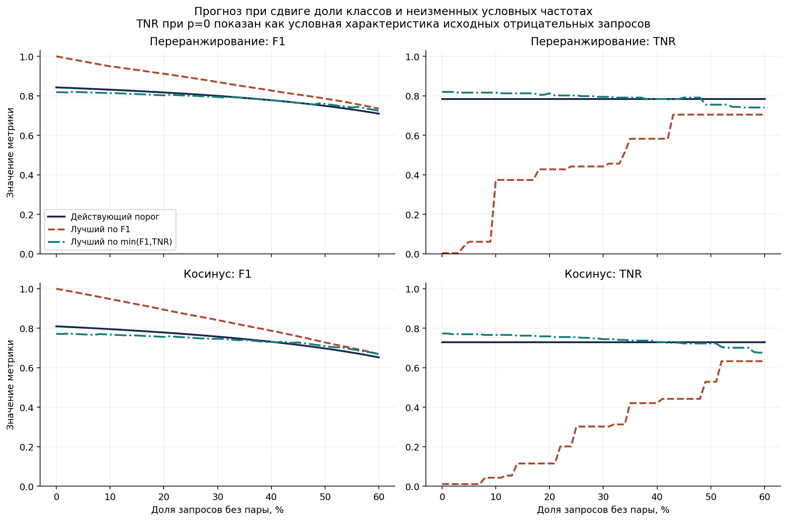
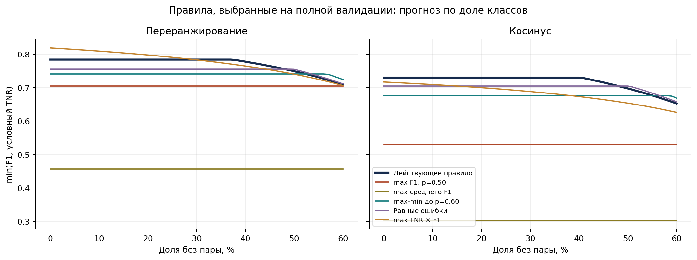
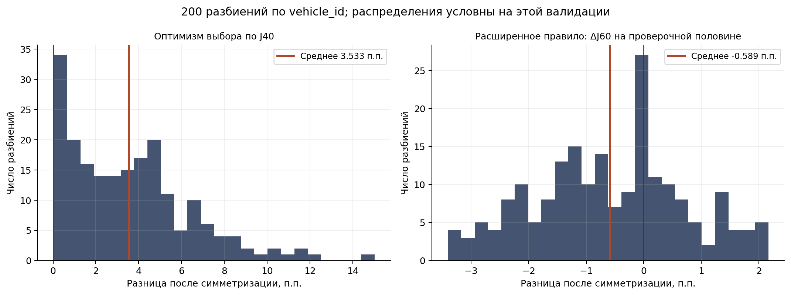
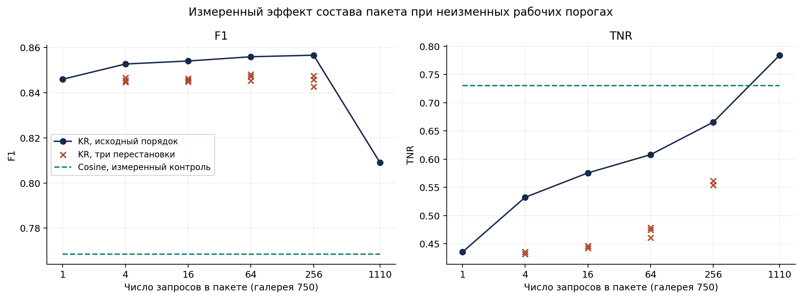

# job_82 — устойчивость порога отказа

Дата: 23.09.2026. Измеряется `main`, HEAD `46bc5ee92c49bde42d555adfa914185d01e47ff9`. Код и конфигурация решения не менялись; commit и push не выполнялись. Расчёты выполнены на `worker-vm`, локально подготовлены скрипты и отчёт.

Во время измерения main обновился параллельной работой до `ec94cffc24762345dcf524220d09e6396a51704d`: добавились только материалы `scaling/atomic-publication`. Все девять используемых исходников/CSV по хешам по-прежнему совпадают с main; [проверка состояния](repository_state.json).

**Оптимизм выбора действующего порога: +0.035326172 по критерию J40 (3.533 п.п.) после симметризации 200 разбиений A→B и B→A.** Это условная оценка эффекта повторного выбора порога; определение скаляра и отдельные F1/TNR приведены ниже.

Для самих метрик отказа симметричный оптимизм составляет **+0.006427124 F1** и **+0.015153634 TNR**.

**Вывод по правилу: сохранять действующее правило и `t_rr=0.5282812306342437`.** Расширение max-min с 40% до 60% неизвестных выбирает `t=0.4398379661659707` и улучшает худший `min(F1,TNR)` на полной валидации на **0.014501**. Однако выбор на A с проверкой на B и обратное направление дают средний результат **на 0.005894 хуже** действующего правила; выигрыш есть лишь в **70/200** симметризованных разбиений. Этот положительный результат полного подбора смену данных не переживает.

Для cosine также сохранять `t_cos=0.5141976914190476`: расширенное правило в среднем теряет **0.002510 J60** на проверочных половинах. Это не доказательство абсолютной оптимальности текущего правила: неизвестны распределение скрытого теста и веса F1/TNR у жюри.

Само действующее правило не оптимально для каждой доли: при 10% неизвестных его F1 ниже доступного F1-максимума на **0.118627**, при 25% — на **0.082664**, при 40% — на **0.049091**, при 60% — на **0.025595**. Но F1-максимум платит отказами: например, при 25% его TNR **0.442446** вместо **0.784173**. Если сравнивать одинаковый компромисс `min(F1,TNR)`, отставание при этих долях соответственно **0.029268 / 0.015628 / 0 / 0.014501**. Это расчёт при чистом сдвиге долей, не измеренные баллы жюри.

**Что переносится в пределах этих разбиений:** максимизация среднего F1 даёт в среднем **+0.073434 F1**, но **−0.294760 TNR**; направление обоих изменений сохраняется во всех 200 симметризованных splits. Это устойчивый обмен метрик, а не общее улучшение режима отказа. Равные ошибки дают лишь **+0.000899 J60** в среднем, с диапазоном центральных 95% разбиений **[−0.014828; +0.015209]**. Произведение TNR×F1 также не даёт устойчивого выигрыша по худшему случаю. Нет основания выбирать новую цифру по единственной полной валидации.

**Ограничение по пакетам существенно важнее небольшой разницы правил.** При неизменном `t_rr` и одиночной подаче всех тех же запросов F1 становится **0.845974**, но TNR падает до **0.435252** вместо **0.784173**. Меняются **252/1110** решений. Следовательно, галереи того же размера недостаточно: рабочий `t_rr` нельзя объявлять откалиброванным для произвольного query-пакета. Для одиночного поиска сохраняется штатная cosine-ветвь; перенос RR на малые пакеты требует отдельно заданного протокола калибровки и его проверки, а не замены порога на победителя этой же валидации.


## 1. Что именно измерено

ТЗ §3 требует обосновать самостоятельно выбранный порог, §9 отводит режиму отказа 10% оценки и называет F1 и TNR, но **не задаёт формулу их объединения в баллы**. Поэтому единственного «оптимального для жюри» порога из ТЗ вывести нельзя. Здесь есть два явно определённых ориентира: максимум F1 при заданной доле p и максимум Jp=min(F1p,TNR). Они выбираются по всем различным top-score плюс `nextafter(max_score,+inf)`; это лучшие наблюдённые точки этой валидации, а не гарантия достижимого качества на скрытом тесте.

Протокол неизменён: `market` исключает same-ID AND same-camera; `presence` считает наличие пары в допустимой галерее. Положительный ответ не обязан иметь правильную идентичность top-1 — это отдельная метрика. Вход: 1110 запросов, 750 gallery, 832 known и 278 unknown; фактическая доля unknown **278/1110 = 25.045045%**. Запросы принадлежат 284 known-ID и 74 unknown-ID.

Взяты неизменённые сервисные эмбеддинги d1_j48 из `job_55/out/val_batch/embeddings.npy`. Пересчитаны cosine и штатный KR(6,3,0.3). F1/TNR, счётчики и оба выбранных порога воспроизведены точно; полный [checkpoint](out/checkpoint.json) содержит хеши и среду.

| Режим | Рабочий порог | TP / FP / FN / TN | F1 | TNR |
| --- | --- | --- | --- | --- |
| rerank | 0.5282812306342437 | 606 / 60 / 226 / 218 | 0.8090787717 | 0.7841726619 |
| cosine | 0.5141976914190476 | 566 / 75 / 266 / 203 | 0.7684996606 | 0.7302158273 |


## 2. Неизвестная доля запросов без пары

**Этот раздел — расчёт по формуле на измеренных условных частотах, не новые наблюдения при каждой доле.** Для неизменных recall r и FPR u используется `F1p = 2(1−p)r / ((1−p)(1+r)+pu)`, TNR=1−u. В вычислениях целочисленно перевзвешены счётчики, а сами метрики посчитаны неизменённым ядром штатного оценщика. Не предполагается, что неизвестный тест сохранит r/u или контекст KR.

Сетка: **0…60%, шаг 1 процентный пункт**. Ниже для чтения показан каждый пятый узел; [полные таблицы всех 61 узлов обеих шкал](prior-tables.md), [RR CSV с точными порогами обоих ориентиров](out/prior_curve_rerank.csv) и [cosine CSV](out/prior_curve_cosine.csv) сохраняют весь расчёт. Потеря — разность лучшего значения соответствующего критерия и нашего, а не баллы конкурса.

**Переранжирование, действующий t_rr.**

| Нет пары | Наш F1 / TNR† | Лучший F1: F1 / TNR† | Потеря F1, п.п. | Лучший min(F1,TNR): F1 / TNR† | Потеря min, п.п. |
| --- | --- | --- | --- | --- | --- |
| 0% | 0.842837 / 0.784173 | 1.000000 / 0.003597 | 15.716 | 0.819021 / 0.820144 | 3.485 |
| 5% | 0.837334 / 0.784173 | 0.974687 / 0.061151 | 13.735 | 0.818546 / 0.816547 | 3.237 |
| 10% | 0.831303 / 0.784173 | 0.949930 / 0.374101 | 11.863 | 0.813440 / 0.816547 | 2.927 |
| 15% | 0.824665 / 0.784173 | 0.931230 / 0.374101 | 10.657 | 0.809165 / 0.812950 | 2.499 |
| 20% | 0.817322 / 0.784173 | 0.911918 / 0.428058 | 9.460 | 0.802801 / 0.812950 | 1.863 |
| 25% | 0.809156 / 0.784173 | 0.891820 / 0.442446 | 8.266 | 0.799801 / 0.802158 | 1.563 |
| 30% | 0.800022 / 0.784173 | 0.870229 / 0.442446 | 7.021 | 0.794079 / 0.794964 | 0.991 |
| 35% | 0.789736 / 0.784173 | 0.847968 / 0.582734 | 5.823 | 0.789026 / 0.791367 | 0.485 |
| 40% | 0.778064 / 0.784173 | 0.827156 / 0.582734 | 4.909 | 0.778064 / 0.784173 | 0.000 |
| 45% | 0.764708 / 0.784173 | 0.806568 / 0.705036 | 4.186 | 0.764732 / 0.791367 | 0.002 |
| 50% | 0.749273 / 0.784173 | 0.786297 / 0.705036 | 3.702 | 0.759504 / 0.755396 | 0.612 |
| 55% | 0.731234 / 0.784173 | 0.762864 / 0.705036 | 3.163 | 0.741335 / 0.744604 | 1.010 |
| 60% | 0.709871 / 0.784173 | 0.735466 / 0.705036 | 2.560 | 0.724372 / 0.741007 | 1.450 |


**Косинус, действующий t_cos.**

| Нет пары | Наш F1 / TNR† | Лучший F1: F1 / TNR† | Потеря F1, п.п. | Лучший min(F1,TNR): F1 / TNR† | Потеря min, п.п. |
| --- | --- | --- | --- | --- | --- |
| 0% | 0.809728 / 0.730216 | 1.000000 / 0.010791 | 19.027 | 0.771956 / 0.773381 | 4.174 |
| 5% | 0.802943 / 0.730216 | 0.974629 / 0.010791 | 17.169 | 0.768960 / 0.769784 | 3.874 |
| 10% | 0.795536 / 0.730216 | 0.948325 / 0.043165 | 15.279 | 0.767890 / 0.766187 | 3.597 |
| 15% | 0.787418 / 0.730216 | 0.921564 / 0.115108 | 13.415 | 0.763273 / 0.762590 | 3.237 |
| 20% | 0.778480 / 0.730216 | 0.894422 / 0.115108 | 11.594 | 0.755925 / 0.758993 | 2.571 |
| 25% | 0.768594 / 0.730216 | 0.867147 / 0.302158 | 9.855 | 0.751819 / 0.755396 | 2.160 |
| 30% | 0.757597 / 0.730216 | 0.841448 / 0.302158 | 8.385 | 0.747592 / 0.744604 | 1.439 |
| 35% | 0.745294 / 0.730216 | 0.813930 / 0.420863 | 6.864 | 0.741065 / 0.737410 | 0.719 |
| 40% | 0.731436 / 0.730216 | 0.787498 / 0.420863 | 5.606 | 0.731436 / 0.730216 | 0.000 |
| 45% | 0.715709 / 0.730216 | 0.759010 / 0.442446 | 4.330 | 0.727931 / 0.723022 | 0.731 |
| 50% | 0.697706 / 0.730216 | 0.728290 / 0.528777 | 3.058 | 0.709407 / 0.723022 | 1.170 |
| 55% | 0.676896 / 0.730216 | 0.700069 / 0.633094 | 2.317 | 0.693660 / 0.701439 | 1.676 |
| 60% | 0.652566 / 0.730216 | 0.669452 / 0.633094 | 1.689 | 0.668810 / 0.676259 | 1.624 |


† При p=0 TNR самого потока не определён: нет отрицательных запросов. В строке 0% и на графике показана **условная** TNR по исходным 278 отрицательным запросам; J0 — только условное продолжение критерия. Для p>0 TNR при чистом сдвиге долей остаётся постоянной у фиксированного порога.



**Почему исходный диапазон не защищает от всех неизвестных долей.** F1p не возрастает с p; поэтому `min(TNR,F1@.10,F1@.25,F1@.40)` точно равно `min(TNR,F1@.40)`. Первые две доли избыточны. Аналогично max-min по 0…60% зависит от p=.60. Это математическое свойство критерия, проверенное на всех порогах обеих шкал, а не новая статистическая находка.


## 3. Правила выбора: цена худшего случая

Все альтернативы определены до split-результатов. «Равновероятно» означает p=.50 (known/unknown поровну). Среднее берётся равномерно по 61 узлу 0…60%. Расширенное max-min включает TNR и F1 на всём этом диапазоне. Равные ошибки — ближайшая достижимая точка FNR=FPR без интерполяции и рандомизации решений. Произведение показано при p=.50 и в среднем по диапазону. При равенстве целевой функции используются больший эмпирический F1, затем TNR, как у действующего правила.

В таблицах F1/TNR измерены на полной валидации при 25.045045%; min F1, J60 и regret — **расчёт по сдвигу долей**. J60=min по диапазону min(F1p,TNR). Максимальный regret сравнивает каждый порог с отдельным Jp-оптимумом при каждой p. Наилучший абсолютный худший результат и наименьшее отставание от адаптивного ориентира — разные цели.

**rerank.**

| Правило | Порог | F1 | TNR | min F1 | J60 | max regret Jp |
| --- | --- | --- | --- | --- | --- | --- |
| Действующее max-min до .40 | 0.5282812306342437 | 0.809079 | 0.784173 | 0.709871 | 0.709871 | 0.034848 |
| max F1 при p=.50 | 0.35505943362279924 | 0.866005 | 0.705036 | 0.735466 | 0.705036 | 0.113985 |
| max среднего F1, p=0…60% | 0.21352112371010223 | 0.891145 | 0.456835 | 0.686995 | 0.456835 | 0.362186 |
| max-min до .60 | 0.4398379661659707 | 0.841026 | 0.741007 | 0.724372 | 0.724372 | 0.078013 |
| Равные FNR/FPR | 0.4861124978927003 | 0.821990 | 0.755396 | 0.711507 | 0.711507 | 0.063625 |
| max TNR×F1 при p=.50 | 0.5951347144692343 | 0.790953 | 0.820144 | 0.706476 | 0.706476 | 0.021775 |
| max среднего TNR×F1 | 0.5951347144692343 | 0.790953 | 0.820144 | 0.706476 | 0.706476 | 0.021775 |


**cosine.**

| Правило | Порог | F1 | TNR | min F1 | J60 | max regret Jp |
| --- | --- | --- | --- | --- | --- | --- |
| Действующее max-min до .40 | 0.5141976914190476 | 0.768500 | 0.730216 | 0.652566 | 0.652566 | 0.041740 |
| max F1 при p=.50 | 0.4373545007729265 | 0.842548 | 0.528777 | 0.660982 | 0.528777 | 0.243179 |
| max среднего F1, p=0…60% | 0.36877167085460877 | 0.866924 | 0.302158 | 0.631053 | 0.302158 | 0.469797 |
| max-min до .60 | 0.4842959715234869 | 0.804925 | 0.676259 | 0.668810 | 0.668810 | 0.095697 |
| Равные FNR/FPR | 0.49946652536426506 | 0.782956 | 0.705036 | 0.657676 | 0.657676 | 0.066920 |
| max TNR×F1 при p=.50 | 0.5680593278567118 | 0.694548 | 0.848921 | 0.626032 | 0.626032 | 0.060664 |
| max среднего TNR×F1 | 0.5680593278567118 | 0.694548 | 0.848921 | 0.626032 | 0.626032 | 0.060664 |


[Все кривые правил RR](out/rule_curves_rerank.csv), [cosine](out/rule_curves_cosine.csv); [полный перебор RR](out/threshold_sweep_rerank.csv) и [cosine](out/threshold_sweep_cosine.csv).




## 4. Главная проверка: оптимизм подбора порога

Из `audit/stability` повторены все 200 seeds и половины 284 known vehicle_id (142 ID на половину). Добавлены 74 unknown-ID, по 37 на половину, отдельной перестановкой `PCG64(SeedSequence([seed,20260923]))`. Итого по 179 vehicle_id в A/B; число кадров меняется. Стратификация сохраняет оба класса; кадры одного автомобиля никогда не попадают в обе половины. [Seeds и размеры](out/seeds.csv), [ID и индексы всех половин](out/splits.json).

В каждом направлении порог выбирается **только по своей половине**, среди её score-точек, затем применяется без изменений ко второй. Gallery, эмбеддинги и полный query-контекст KR зафиксированы, как в исходной методике stability. Никакой перекалибровки на проверочной половине нет.

Основной скаляр — разрыв **того критерия, который выбирали**, `J40=min(TNR,F1@.10,F1@.25,F1@.40)`. Для split s:

`optimism_s = ½[(J_A(t_A)−J_B(t_A)) + (J_B(t_B)−J_A(t_B))]`.

Итог — среднее по 200 splits. Это аналог измерения mAP-оптимизма в stability, но в единицах J40. Его нельзя напрямую сравнивать с 0.0069 mAP как с одной шкалой.

| Шкала | J40 A→B | J40 B→A | Симметричный оптимизм | Центральные 95% разбиений |
| --- | --- | --- | --- | --- |
| rerank | +0.034845174 | +0.035807170 | +0.035326172 | [0.000970; 0.104477] |
| cosine | +0.037326920 | +0.023945648 | +0.030636284 | [0.003676; 0.090139] |


Отдельные метрики того же выбранного порога (среднее по 400 направлениям; «оптимизм» — симметричный fit−test):

| Шкала | Метрика | На половине подбора | На второй половине | Оптимизм |
| --- | --- | --- | --- | --- |
| rerank | F1 при фактической доле половины | 0.813989 | 0.807561 | +0.006427124 |
| rerank | F1, стандартизованный p=.25 | 0.814065 | 0.807582 | +0.006482478 |
| rerank | TNR | 0.789757 | 0.774603 | +0.015153634 |
| cosine | F1 при фактической доле половины | 0.770372 | 0.767292 | +0.003079905 |
| cosine | F1, стандартизованный p=.25 | 0.770499 | 0.767441 | +0.003058446 |
| cosine | TNR | 0.735840 | 0.729143 | +0.006696961 |


Симметризация у фиксированного порога без нового выбора даёт **точно 0** для F1, TNR и J40 во всех 200 splits: эффект произвольного обозначения половин удалён. Значения F1 при фактической доле половины и при p=.25 разделены, чтобы видеть влияние колебаний состава классов.

Разброс выбираемого действующим правилом порога:

| Шкала | Медиана | Центральные 95% | Min–max | Различных порогов |
| --- | --- | --- | --- | --- |
| rerank | 0.534373512 | [0.413370; 0.597829] | [0.347959284; 0.649535942] | 60 |
| cosine | 0.514197691 | [0.486525; 0.538139] | [0.472972536; 0.547087113] | 74 |


**Сравнение правил на второй половине.** Каждое правило выбирает собственный порог на той же A; сравнение идёт с порогом действующего правила, также выбранным только на A. Здесь нет сравнения с фиксированным глобальным порогом, уже видевшим B. В таблице средние парные разности проверочных метрик; интервал и победы относятся к 200 симметризованным splits, не к независимым тестовым наборам.

**rerank, альтернативы минус действующее правило.**

| Правило | Δ F1 | Δ TNR | Δ J60 | 95% разбиений для Δ J60 | Побед J60 / 200 |
| --- | --- | --- | --- | --- | --- |
| max F1 при p=.50 | +0.056817 | -0.123333 | -0.051978 | [-0.169488; 0.012389] | 30 |
| max среднего F1, p=0…60% | +0.073434 | -0.294760 | -0.221984 | [-0.303791; -0.141239] | 0 |
| max-min до .60 | +0.024378 | -0.040054 | -0.005894 | [-0.029929; 0.018440] | 70 |
| Равные FNR/FPR | +0.012847 | -0.021709 | +0.000899 | [-0.014828; 0.015209] | 125 |
| max TNR×F1 при p=.50 | -0.027946 | +0.025796 | -0.015438 | [-0.049247; 0.012084] | 30 |
| max среднего TNR×F1 | -0.019248 | +0.018908 | -0.010970 | [-0.044553; 0.011573] | 33 |


**cosine, альтернативы минус действующее правило.**

| Правило | Δ F1 | Δ TNR | Δ J60 | 95% разбиений для Δ J60 | Побед J60 / 200 |
| --- | --- | --- | --- | --- | --- |
| max F1 при p=.50 | +0.062170 | -0.212669 | -0.135757 | [-0.229940; -0.062006] | 0 |
| max среднего F1, p=0…60% | +0.091059 | -0.433541 | -0.353793 | [-0.486250; -0.266522] | 0 |
| max-min до .60 | +0.024345 | -0.046481 | -0.002510 | [-0.042108; 0.019530] | 112 |
| Равные FNR/FPR | +0.015396 | -0.021897 | +0.003171 | [-0.018988; 0.015864] | 141 |
| max TNR×F1 при p=.50 | -0.094960 | +0.112218 | -0.046319 | [-0.071914; -0.014150] | 3 |
| max среднего TNR×F1 | -0.079222 | +0.096051 | -0.037820 | [-0.065232; -0.012590] | 4 |


[Все 5600 выборов и проверочных результатов](out/selection_all.csv), [полная статистика, включая оптимизм каждого правила](out/split_summary.json).



**Границы.** Половины сильно перекрываются; их 2.5–97.5% квантили — распределение условной устойчивости, **не доверительный интервал эффекта на скрытом тесте**. Никакой p-value по 400 псевдонезависимым наблюдениям не вычисляется. Модели, whitening, выбор семейства и сама валидация уже использовались раньше; эта проверка не убирает всю историческую адаптацию. Оптимизм измерен для подбора на половине данных (179 ID), а не как точная поправка к порогу, подобранному на всех 358 ID. Вычитать оптимизм J40 из F1=0.809079 и объявлять остаток истинной F1 нельзя.


## 5. Малые пакеты: реальное изменение состава KR

Здесь **измерение**, а не пересчёт доли формулой. Для каждого пакета заново вызван неизменённый сервисный `rerank_scores` на его query и всех 750 gallery. Все 1110 ответов объединены в исходном порядке и оценены одним `evaluate` при неизменном `t_rr=0.5282812306342437`. Средние F1 отдельных пакетов не используются. Изображения и векторы не меняются.

Каждый размер проверен на исходном порядке и трёх заранее заданных перестановках. Для singleton все перестановки дают те же контексты, поэтому он посчитан один раз. В столбцах диапазона — только три перестановки, это не оценка доверительного интервала.

| Размер | F1, исходный | TNR, исходный | Δ F1 | Δ TNR | Смен решений /1110 | F1, случайные | TNR, случайные |
| --- | --- | --- | --- | --- | --- | --- | --- |
| 1 | 0.845974 | 0.435252 | +0.036896 | -0.348921 | 252 | — | — |
| 4 | 0.852713 | 0.532374 | +0.043634 | -0.251799 | 183 | 0.844626…0.846647 | 0.431655…0.435252 |
| 16 | 0.854041 | 0.575540 | +0.044962 | -0.208633 | 164 | 0.844757…0.846289 | 0.442446…0.446043 |
| 64 | 0.855927 | 0.607914 | +0.046848 | -0.176259 | 149 | 0.845385…0.848057 | 0.460432…0.478417 |
| 256 | 0.856613 | 0.665468 | +0.047534 | -0.118705 | 124 | 0.842615…0.847498 | 0.553957…0.561151 |
| 1110 | 0.809079 | 0.784173 | +0 | +0 | 0 | — | — |




Контроль cosine проверяет отдельно изменения score от порядка вычислений BLAS и возможное пересечение точного порога. Исходные F1/TNR равны 0.768500 / 0.730216. [Cosine-контроль](out/cosine_batch_control.json), [контроль перестановки полного query-пула](out/full_permutation_control.json).

| Пакет cosine | F1 | TNR | Смен решений | max abs(Δ score) |
| --- | --- | --- | --- | --- |
| 1 | 0.768500 | 0.730216 | 0 | 1.332e-15 |
| 4 | 0.768500 | 0.730216 | 0 | 0.000e+00 |
| 16 | 0.768500 | 0.730216 | 0 | 0.000e+00 |
| 64 | 0.768500 | 0.730216 | 0 | 0.000e+00 |
| 256 | 0.768500 | 0.730216 | 0 | 0.000e+00 |

Диагностическая перекалибровка на каждом исходном пакетном сценарии (те же данные для выбора и оценки, **без обещания переноса**):

| Пакет | Подобранный t | F1 после подбора | TNR после подбора | J40 после подбора |
| --- | --- | --- | --- | --- |
| 1 | 0.7619832981967889 | 0.800805 | 0.776978 | 0.768982 |
| 4 | 0.7126871840704594 | 0.780027 | 0.741007 | 0.741007 |
| 16 | 0.6830945574865421 | 0.790323 | 0.755396 | 0.755396 |
| 64 | 0.6742913471193711 | 0.783547 | 0.748201 | 0.748201 |
| 256 | 0.654793982468018 | 0.785666 | 0.762590 | 0.752258 |


[Все 17 пакетных сценариев](out/batch_results.csv), [результаты запросов и состав пакетов](out/batches/). Пакетная чувствительность затрагивает и ранжирование; mAP/Rank-1 каждого сценария сохранены в CSV. Это не тест HTTP API: его штатный путь — cosine.


## 6. Проверяемость и воспроизведение

Финальная проверка: **passed**. 42 прямых сверок перевзвешивания (включая p=0, точные повторения реальных строк и крайние пороги), 560 прямых проверок половин через публичный `evaluate`, 14 проверок выбранных точек, 5600 восстановленных строк выбора, 200 replay seeds и 17 пакетных сценариев. Максимальная ошибка перевзвешивания **0.0**. [Проверка](out/verification.json), [журнал](journal.md).

Целостность итогового комплекта: [manifest.json](manifest.json) и [SHA256SUMS](SHA256SUMS); проверка `sha256sum -c SHA256SUMS`.

Исходники штатного контура, адаптер и сервисные score-функции скопированы без правок в `inputs/04-solution/`; хеши совпадают с исследованным main. Скрипты этого задания только организуют вызовы, делят группы и суммируют результаты. F1/TNR/recall реализованы исключительно существующим evaluator через его существующий `metric_adapter.metric_kernel`. Отдельных новых метрических формул в коде нет. Для изменения долей используется точное целочисленное повторение счётчиков вместо материализации миллионов дубликатов; эквивалентность проверена `evaluate` на реально повторённых строках.

Полный комплект на узле: `~/lct-reid/jobs/job_82/`. Скопированный сюда комплект содержит векторы, score-матрицы, источники, seeds и результаты. Среда: Python 3.14.3, NumPy 2.4.6, Matplotlib 3.10.8 для графиков. Расчётный процесс использует один поток BLAS; два независимых этапа выполнялись параллельно, суммарно не более двух CPU.

```bash
# Выполнять на worker-vm в каталоге job_82
export PYTHONDONTWRITEBYTECODE=1
sha256sum -c input-source-sha256.txt
python3 measure.py prepare
python3 measure.py curves
python3 splits.py
python3 batches.py
python3 verify.py
python3 figures.py
python3 build_report.py
```

Для SSH из текущей сети потребовался socket-only `SO_MARK`, поскольку уже работающий WireGuard перехватывал маршрут к Tailscale. `worker_proxy.py` ограничен адресом worker и портами 22/2222; маршруты, VPN и службы не менялись. Это только транспорт расчёта и к метрикам отношения не имеет.
