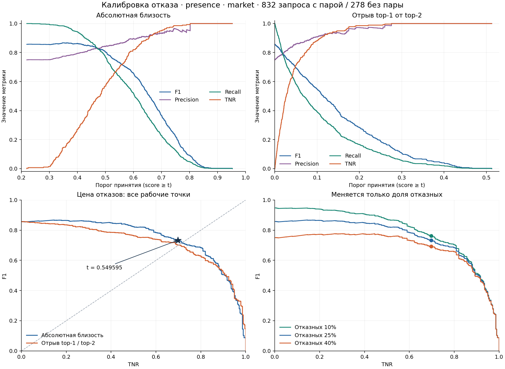
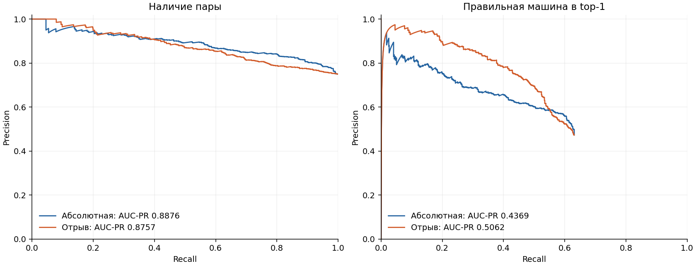

# Калибровка порога отказа

## Итог и рекомендуемая рабочая точка

**Для исходного протокола `presence + market` рекомендую временный порог `0.5495953464415451`:** F1 **0.7331**, precision **0.8632**, recall **0.6370**, TNR **0.6978**. Это явный компромисс по F1 и TNR при трёх возможных долях отказных. Неизвестная формула оценки жюри из этих данных не восстанавливается.

Старый максимум F1 воспроизведён точно: **`0.34921352213815304`**, F1 **0.8671**, TNR **0.1439**. Его низкий TNR — свойство выбранной цели оптимизации, а не ошибка перебора. При реальной доле отказных 0.10/0.25/0.40 рекомендуемый фиксированный порог даёт F1 **0.7626/0.7332/0.6930**, TNR **0.6978** во всех трёх сценариях при неизменных условных распределениях.

Если требуется именно **эмпирический TNR ≥ 0.70**, ближайшая точка — `0.5505529232665857`: F1 **0.7300**, TNR **0.7014**. Гарантии такого TNR на новом тесте нет. Если F1 требует правильной машины в top‑1, вывод о лучшем признаке меняется (§6).

## 1. Что измерено и какие допущения сделаны

- Векторы: 1110 × 512 и 750 × 512, все значения конечны. Порядок `.ids` точно совпал с CSV; пересечения кадров query/gallery нет. Косинусы рассчитаны `scores_from_embeddings` контура в float64, с его нормировкой.
- По разметке **832** запроса имеют пару и **278** не имеют; это **25.045045%** отказных, а не ровно 25%. В query 284 известных и 74 отказных идентичностей. Флаги `has_mate` пересчитаны по галерее, расхождений нет; после камерной фильтрации ни один известный запрос не потерял все верные пары.
- Основной результат использует тот же режим, что исходный порог: `presence`, где положительный класс — **в галерее существует пара**. Он не проверяет правильность принятого top‑1. `top1` дополнительно требует верной идентичности; для него также рассчитаны полные кривые.
- `market` исключает совпадение **vehicle_id И camera_id**; `all_same_camera` исключает все кадры камеры запроса. Это маски оценки по разметке. Ранжирование стабильно по исходному порядку галереи при точном равенстве score.
- Принятие: **score ≥ t**, отказ: **score < t**. Для относительного признака `s₁−s₂` берутся два **изображения** галереи после той же маски, без группировки по неизвестным идентичностям. Малый gap может быть вызван двумя правильными кадрами одной машины.
- F1, precision, recall, TNR, PR-AUC, AP-step и mINP получены существующим контуром. Для быстрого перебора его `_pr_events` даёт события и счётчики, а [адаптер](metric_adapter.py) исполняет неизменённые AST-выражения `positives`, `fn`, `refusal` из `_evaluate_full`. Собственных формул этих метрик нет. Побайтовый [снимок контура](evaluator_snapshot/reid_metrics.py) и [SHA-256 входов](results/manifest.json) приложены.

Трактовка ТЗ взята из предоставленного [context-tz.txt, раздел 9](context-tz.txt): названы F1 и TNR, их веса внутри критерия не указаны. Во внешние источники данные не отправлялись.

## 2. Вся шкала порога: F1, precision, recall, TNR

Ниже точки по всей шкале TNR, включая крайние решения. Для каждого уровня TNR выбран **наименьший представимый порог**, который достигает уровня: `nextafter` соответствующего отказного score вверх. Это сохраняет максимальный recall при таком ограничении; дополнительной подгонки F1 в этих строках нет. Из-за 278 отрицательных запросов TNR меняется шагами по 1/278, поэтому уровни иногда превышены.

| Точка | Порог t* | F1 | Precision | Recall | TNR |
| --- | --- | --- | --- | --- | --- |
| Принимать всех | 0.219153 | 0.8568 | 0.7495 | 1.0000 | 0.0000 |
| Максимум F1 | 0.349214 | 0.8671 | 0.7748 | 0.9844 | 0.1439 |
| TNR ≥ 0.1 | 0.336890 | 0.8617 | 0.7661 | 0.9844 | 0.1007 |
| TNR ≥ 0.2 | 0.374524 | 0.8648 | 0.7834 | 0.9651 | 0.2014 |
| TNR ≥ 0.3 | 0.410147 | 0.8600 | 0.7996 | 0.9303 | 0.3022 |
| TNR ≥ 0.4 | 0.441220 | 0.8482 | 0.8158 | 0.8834 | 0.4029 |
| TNR ≥ 0.5 | 0.479784 | 0.8237 | 0.8303 | 0.8173 | 0.5000 |
| TNR ≥ 0.6 | 0.509026 | 0.7848 | 0.8458 | 0.7320 | 0.6007 |
| TNR ≥ 0.7 | 0.550553 | 0.7300 | 0.8637 | 0.6322 | 0.7014 |
| TNR ≥ 0.8 | 0.584836 | 0.6840 | 0.8934 | 0.5541 | 0.8022 |
| TNR ≥ 0.9 | 0.654709 | 0.5061 | 0.9151 | 0.3498 | 0.9029 |
| TNR ≥ 1.0 | 0.802053 | 0.0874 | 1.0000 | 0.0457 | 1.0000 |
| Максимум min(F1, TNR) | 0.555230 | 0.7214 | 0.8668 | 0.6178 | 0.7158 |
| Компромисс по трём долям | 0.549595 | 0.7331 | 0.8632 | 0.6370 | 0.6978 |
| Отказать всем | 0.952549 | 0.0000 | — | 0.0000 | 1.0000 |

Примечание к t*: для чтения пороги показаны с шестью знаками; метрики посчитаны по полным значениям в CSV/JSON. Последняя строка — `nextafter(max score, +∞)`, а не округлённый максимум. При отсутствии принятых запросов precision не определён, F1 = 0. На этой выборке ниже минимального score 0.2191533 всё принимается, выше максимального 0.9525491 всё отклоняется; интервалы между соседними событиями имеют постоянные метрики.

**Полный перебор:** [1111 рабочих точек абсолютного порога](results/curve_market_absolute_presence.csv), [1111 точек gap](results/curve_market_gap_presence.csv), [равномерная сетка косинуса −1…1](results/grid_market_absolute_presence.csv), [точки для таблицы](results/selected_market_absolute_presence.csv). В полных CSV также есть TP/FP/FN/TN и обе площади PR. Ни одного возможного набора решений между соседними score не пропущено.



**Почему максимум F1 почти всё принимает.** Если принимать всех, TP = 832, FP = 278, FN = 0, F1 = **0.8568**, TNR = **0**. Оптимизация F1 улучшает его всего на **0.01028**: TP = 819, FP = 238, FN = 13, TN = 40. Получается 1057 принятий, 53 отказа, в том числе 13 ошибочных. **238/278 чужих запросов всё ещё принимаются.** Высокий F1 здесь обеспечен преобладанием положительного класса и не означает хороший режим отказа.

Есть промежуточные точки: при TNR = 0.5000 F1 = 0.8237; при TNR = 0.7014 F1 = 0.7300. Но одновременно высоких значений нет: максимальное `min(F1,TNR)` на текущей смеси — **0.7158**. Значит, пары F1 ≥ 0.8 и TNR ≥ 0.8 для этого признака и протокола **не существует**. «Разумный баланс» здесь означает осознанную потерю recall, а не бесплатное улучшение.

Важна точность порога: округление старого `0.34921352213815304` до `0.349214` исключает ещё один известный запрос: F1 становится **0.866525**, recall **0.983173**. Рекомендуемый порог после округления до `0.549595` даёт те же счётчики на этом вал-сплите; точное значение сохранено в [recommendation.json](results/recommendation.json).

## 3. Сколько F1 стоит каждая десятая доля TNR

Цена = **(F1 до − F1 после) × 0.10 / фактический прирост TNR**. Это разность измеренных метрик, а не новый вариант метрики. Отрицательная цена означает улучшение F1. Столбец нормировки учитывает дискретность TNR.

| Целевой TNR | Фактический TNR | F1 до → после | Потеря F1 | Цена +0,10 TNR |
| --- | --- | --- | --- | --- |
| 0.0 → 0.1 | 0.0000 → 0.1007 | 0.8568 → 0.8617 | -0.00480 | -0.00477 |
| 0.1 → 0.2 | 0.1007 → 0.2014 | 0.8617 → 0.8648 | -0.00318 | -0.00316 |
| 0.2 → 0.3 | 0.2014 → 0.3022 | 0.8648 → 0.8600 | +0.00484 | +0.00480 |
| 0.3 → 0.4 | 0.3022 → 0.4029 | 0.8600 → 0.8482 | +0.01176 | +0.01168 |
| 0.4 → 0.5 | 0.4029 → 0.5000 | 0.8482 → 0.8237 | +0.02450 | +0.02522 |
| 0.5 → 0.6 | 0.5000 → 0.6007 | 0.8237 → 0.7848 | +0.03895 | +0.03867 |
| 0.6 → 0.7 | 0.6007 → 0.7014 | 0.7848 → 0.7300 | +0.05475 | +0.05435 |
| 0.7 → 0.8 | 0.7014 → 0.8022 | 0.7300 → 0.6840 | +0.04607 | +0.04574 |
| 0.8 → 0.9 | 0.8022 → 0.9029 | 0.6840 → 0.5061 | +0.17789 | +0.17662 |
| 0.9 → 1.0 | 0.9029 → 1.0000 | 0.5061 → 0.0874 | +0.41873 | +0.43114 |

**Единой цены нет.** Переход от старого максимума F1 к TNR ≥ 0.7 стоит **0.13708 F1** за **0.55755 TNR**, в среднем **0.02459 F1 на +0.10 TNR**. На участке 0.8→0.9 цена уже **0.17662**, а 0.9→1.0 — **0.43114**. Все разности и нормировки — [tnr_cost.csv](results/tnr_cost.csv).

## 4. Неизвестная доля запросов без пары

### Метод: чистое изменение доли класса

**Галерея, запросы, модель, scores и распределения внутри классов неизменны.** Для каждой заданной доли всем известным запросам присвоена одна целочисленная кратность, всем неизвестным — другая; `_pr_events` контура получает буквально повторённые события. Кратности known/unknown: **1251/416** для 0.10, **417/416** для 0.25, **417/832** для 0.40. Это точное перевзвешивание, без случайного подвыбора и потери данных. Повторения **не увеличивают статистический размер выборки**.

Предположение — меняется только вероятность класса (prior shift). Генератор `make_split.py --p-refusal` **не запускался**: он меняет также состав query/идентичностей и иногда train_fit, а в задании выданы эмбеддинги только фиксированного сплита. Это исследование доли класса, **не три новых сплита** и не проверка переноса на новые изображения. Эффекты другого состава галереи и сдвига score остаются неизвестными.

### Максимум F1 для каждой доли

| Отказных | Порог max F1 | F1 max | Precision | Recall | TNR | F1 при старом t |
| --- | --- | --- | --- | --- | --- | --- |
| 0.1 | 0.237711 | 0.9477 | 0.9006 | 1.0000 | 0.0072 | 0.9467 |
| 0.25 | 0.349214 | 0.8674 | 0.7753 | 0.9844 | 0.1439 | 0.8674 |
| 0.4 | 0.398998 | 0.7771 | 0.6599 | 0.9447 | 0.2698 | 0.7705 |

0.25 здесь означает ровно 25%, поэтому F1 немного отличается от основной таблицы с 278/1110 отказных. Порог максимума меняется **0.237711 → 0.349214 → 0.398998**, но TNR остаётся **0.0072 → 0.1439 → 0.2698**. Даже 40% чужих запросов не делают максимум F1 хорошей политикой отказа.

### Насколько плохо ошибиться в доле

В каждой ячейке — F1 на доле из столбца с порогом, выбранным по максимуму F1 на доле из строки:

| Доля при выборе t → реальная доля | 0.10 | 0.25 | 0.40 |
| --- | --- | --- | --- |
| 0.1 | 0.9477 | 0.8580 | 0.7514 |
| 0.25 | 0.9467 | 0.8674 | 0.7705 |
| 0.4 | 0.9327 | 0.8635 | 0.7771 |

Если выбрать старый порог на 25%, а реально будет 10% или 40%, потери относительно доступного F1-оптимума этих сценариев — **0.00098** и **0.00654**. Худший перенос между любыми двумя из трёх долей — **0.02570 F1** (выбор на 10%, оценка на 40%). Следовательно, сама ошибка в доле умеренно портит F1; главная проблема — низкий TNR сохраняется. Перенос и потери для всех признаков: [prior_transfer.csv](results/prior_transfer.csv).

### Фиксированный рекомендуемый порог, без подстройки к скрытому тесту

| Отказных | Фиксированный t | F1 | Precision | Recall | TNR | Цена к max F1 этой доли |
| --- | --- | --- | --- | --- | --- | --- |
| 0.1 | 0.549595 | 0.7626 | 0.9499 | 0.6370 | 0.6978 | 0.1851 |
| 0.25 | 0.549595 | 0.7332 | 0.8635 | 0.6370 | 0.6978 | 0.1342 |
| 0.4 | 0.549595 | 0.6930 | 0.7598 | 0.6370 | 0.6978 | 0.0841 |

При чистом prior shift TNR и recall фиксированного правила **точно не меняются**, потому что это доли внутри соответствующего класса. Меняются precision и F1. Совпадение recall/TNR проверено для всех событий во всех трёх сценариях, а не только для выбранного порога.

Для сравнения, AUC-PR абсолютного признака при 0.10/0.25/0.40 равен **0.9587/0.8878/0.8030**. Он независим от выбранного порога, но **не от доли положительного класса**; высокий AUC при 10% отказных нельзя напрямую сравнивать с AUC при 40%.

## 5. Абсолютный порог против отрыва первого кандидата

При одинаковой камерной маске и семантике `presence`:

| Признак (market, presence) | t max F1 | F1 max / TNR | t при TNR ≥ 0.7 | F1 / Recall при TNR ≥ 0.7 | AUC-PR / AP-step |
| --- | --- | --- | --- | --- | --- |
| s₁ | 0.34921352 | 0.8671 / 0.1439 | 0.55055292 | 0.7300 / 0.6322 | 0.8876 / 0.8877 |
| s₁ − s₂ | 0.00007786 | 0.8573 / 0.0036 | 0.04812010 | 0.7012 / 0.5938 | 0.8757 / 0.8759 |

У gap наблюдаемые AUC-PR ниже на **0.01186**, F1 при одном и том же TNR = 0.7014 ниже на **0.02884**, recall ниже на **0.03846**. В основном протоколе оснований заменять абсолютный score отрывом нет.

| Отказных | t max F1 для gap | F1 | TNR | F1 при фиксированном компромиссе gap |
| --- | --- | --- | --- | --- |
| 0.1 | 0.00007786 | 0.9475 | 0.0036 | 0.7493 |
| 0.25 | 0.00007786 | 0.8576 | 0.0036 | 0.7188 |
| 0.4 | 0.00061385 | 0.7512 | 0.0216 | 0.6774 |

Порог gap по максимуму F1 почти не меняется, но это устойчивость **почти полного принятия**: TNR 0.0036–0.0216. Его фиксированный компромисс `0.044570231328764476` даёт TNR **0.6835** и F1 **0.7493/0.7188/0.6774** при трёх долях — хуже абсолютного компромисса. Максимальная потеря F1 при переносе F1-оптимального gap между долями всего **0.00211**, но такая стабильность не решает задачу отказа.

**Статистическая оговорка:** 95% интервалы кластерного bootstrap для разностей «absolute − gap»: AUC-PR **[-0.0205; 0.0389]**, F1 при фиксированных порогах TNR≈0.7 **[-0.0194; 0.0740]**. Они включают ноль. Речь о лучшем наблюдаемом результате, а не о доказанном превосходстве на любой новой выборке.



## 6. Развилки протокола, которые меняют ответ

### Если F1 требует правильной машины

| Режим / признак | t max F1 | F1 max | TNR при max F1 | F1 при TNR ≥ 0.7 | AUC-PR |
| --- | --- | --- | --- | --- | --- |
| presence / s₁ | 0.34921352 | 0.8671 | 0.1439 | 0.7300 | 0.8876 |
| presence / s₁−s₂ | 0.00007786 | 0.8573 | 0.0036 | 0.7012 | 0.8757 |
| top1 / s₁ | 0.45553824 | 0.5817 | 0.4460 | 0.5219 | 0.4369 |
| top1 / s₁−s₂ | 0.03801049 | 0.5880 | 0.6223 | 0.5763 | 0.5062 |

При `top1` результат другой: gap повышает AUC-PR **0.4369 → 0.5062**, F1 при TNR≈0.7 **0.5219 → 0.5763**, а максимум F1 **0.5817 → 0.5880**. Если жюри выберет эту семантику, рабочий компромисс gap — **`0.04517222131034537`**: F1 **0.5828**, TNR **0.6871**; при долях 0.10/0.25/0.40 F1 **0.6075/0.5829/0.5496**. Это условная рекомендация для score после маски; возможность вычислить такую маску в сервисе ещё требует решения.

Именно поэтому F1=0.733 основного компромисса нельзя называть точностью идентификации машины. В `top1` ошибочно принятый известный запрос даёт FP и остаётся FN; его доля не входит в знаменатель TNR, который относится только к настоящим отказным. Максимально достижимый recall для top1 ограничен Rank-1 = 0.6310; контур не достраивает PR-кривую до недостижимого recall = 1.

### Камерная фильтрация и доступный сервису score

| Камера | Собственный t компромисса | F1 | TNR | F1 при TNR ≥ 0.7 | AUC-PR |
| --- | --- | --- | --- | --- | --- |
| market | 0.54959535 | 0.7331 | 0.6978 | 0.7300 | 0.8876 |
| all_same_camera | 0.54732621 | 0.7312 | 0.6906 | 0.7265 | 0.8876 |
| unfiltered | 0.68578661 | 0.9433 | 0.9424 | 0.9342 | 0.9908 |

Переход `market → all_same_camera` почти не меняет вывод: при том же пороге TNR≥0.7 F1 **0.7300 → 0.7265**. Но отключение маски резко меняет распределение известных запросов: им снова доступны совпадения с той же камеры. Это отдельный протокол, его высокие числа не заменяют кросс-камерную оценку.

Без фильтрации абсолютный признак также лучше отрыва: AUC-PR **0.9908 против 0.9813**, максимум F1 **0.9485 против 0.9271**. Его собственный компромисс — `0.6857866100088712`. Это альтернатива только для сценария, где оценивается пустота **сырого ответа**, а не допустимого после маски списка.

На текущем вал-сплите основной порог `0.5495953464415451` даёт **224** пустых сырых ответов и **496** пустых ответов после `market`; из последних **194** — верные отказы, **302** — потерянные запросы с парой. Значит, оценочная пустота после фильтрации и отказ, реально показанный клиенту, различаются.

Проверен и **raw-gap**, вычисляемый до любой маски и доступный без меток камер: если им открывать/закрывать весь список, а верность top‑1 затем оценивать после `market`, при TNR=0.7014 получается F1 presence **0.9254**, но F1 top1 **0.5884**, AUC-PR top1 **0.3412**. Это отдельное правило допуска списка, использующее в том числе одноместного двойника. Его нельзя смешивать с gap после маски или считать улучшением ранжирования. Полные результаты — [robustness.json](results/robustness.json), [кривая raw-gap top1](results/curve_market_raw_gap_top1.csv).

Абсолютный **покандидатный** порог можно применить до маски: операции «score ≥ t» и удаления камерных совпадений коммутируют. Для gap это неверно: после удаления первого или второго кадра сам признак меняется. В тесте camera_id не выданы, а `market` требует ещё и истинных vehicle_id — напрямую вычислять такой gap в сервисе нельзя без отдельного приближения.

Число **3 отказа из 1110 на выданном тесте** дано в брифе; здесь оно **не пересчитано**, так как тестовые эмбеддинги не выданы в каталоге задания. Весь численный вывод этого отчёта рассчитан на val. Из распределения тестовых scores нельзя восстановить TNR без меток.

### Полная галерея и top‑10

`evaluate()` выдаёт обе ветки ранжирования, но его `refusal_scope` всегда **full_eligible_gallery**. Поэтому совпадение отказов с top‑10 проверено отдельно по сохранённым спискам: **0 изменений top‑1 и 0 изменений top‑2** при усечении сырой галереи до 10 до маски, обе камерные политики. Минимум оставшихся кандидатов — **9** для market и **4** для all_same_camera. Следовательно, на этих данных абсолютный score и gap, а значит все кривые query-level отказа, совпадают для полной галереи и обоих порядков усечения. Это проверенное свойство этого набора, не общий закон.

Ранжирующие метрики при этом различаются:

| Камера | Галерея/порядок | mAP | mINP (undefined / zero) | Неполных списков |
| --- | --- | --- | --- | --- |
| market | Полная | 0.6566 | 0.6070 | — |
| market | top_k_then_filter | 0.6451 | не определён / 0.5901 | 222 |
| market | filter_then_top_k | 0.6468 | не определён / 0.5923 | 210 |
| all_same_camera | Полная | 0.6612 | 0.6117 | — |
| all_same_camera | top_k_then_filter | 0.6488 | не определён / 0.5937 | 222 |
| all_same_camera | filter_then_top_k | 0.6515 | не определён / 0.5968 | 205 |

При усечении mINP по умолчанию не определён из-за неполных списков; второе число — явная альтернативная политика присваивать таким запросам ноль. mINP исходного ранжирования не меняется от выбора порога и не сравнивает качество двух признаков отказа. Для этого в отчёте использован PR-AUC.

## 7. Проверка устойчивости выбора порога

**500 bootstrap-выборок целыми `vehicle_id`**, отдельно внутри классов, seed 20260915. Для фиксированного рекомендуемого порога 95% перцентильные интервалы: F1 **[0.6933; 0.7709]**, TNR **[0.6067; 0.7891]**. Это условная неопределённость при фиксированной галерее; не гарантия на скрытом тесте и не интервал для заново оптимизированного порога. Считать 278 коррелированных кадров 278 независимыми машинами было бы чрезмерно оптимистично.

**5 повторов 5-fold калибровки по идентичностям.** Каждый порог выбран на четырёх folds по тому же устойчивому критерию, решения оценены на пятом; пороги вычтены из scores, и совокупные out-of-fold решения измерены тем же контуром. Идентичности калибровочных и проверочных запросов не пересекаются. Энкодер и галерея остаются фиксированными; это проверка калибровки, не переобучение модели и не новый внешний тест.

| Признак | F1, среднее [min; max] | TNR, среднее [min; max] | Пороги, 2.5–97.5 перцентили |
| --- | --- | --- | --- |
| absolute | 0.7346 [0.7314; 0.7392] | 0.6928 [0.6799; 0.6978] | [0.535247; 0.555230] |
| gap | 0.7157 [0.7110; 0.7178] | 0.6827 [0.6799; 0.6835] | [0.043784; 0.046539] |

Здесь скобки min/max — разброс пяти повторов, **не доверительный интервал**. Перцентили порогов относятся к 25 обучающим folds. Итог согласуется с оценкой на всём вал-сплите, но не устраняет неизвестность состава закрытой галереи. Все повторы: [crossfit_pooled.csv](results/crossfit_pooled.csv), [crossfit_folds.csv](results/crossfit_folds.csv), [bootstrap.csv](results/bootstrap.csv).

## 8. Обоснование для защиты

**Правило было зафиксировано до просмотра результатов:** выбрать t, максимизирующий

`min(TNR(t), F1(t; p=0.10), F1(t; p=0.25), F1(t; p=0.40))`.

Это прозрачная политика равной защиты двух показателей при неизвестной доле отказных. Она **не является формулой жюри**: равное отношение к F1 и TNR — наше явно заявленное инженерное предпочтение. При иной цене ложного принятия или ином весе TNR нужно выбрать другую точку приложенной кривой. В заданном диапазоне худший F1 приходится на p=0.40; лучший минимум показателей равен **0.6930**.

При переходе от старого порога к предлагаемому:

- F1 **0.8671 → 0.7331**, потеря **0.1341**.
- TNR **0.1439 → 0.6978**, выигрыш **0.5540**; ложных принятий чужих **238 → 84**, на **154 меньше**.
- Recall **0.9844 → 0.6370**; принятых запросов с парой **819 → 530**, на **289 меньше**. Цена улучшения отказов существенна и не скрывается.
- При ошибке в доле классов TNR/recall сохраняются только в модели чистого prior shift; ожидаемый F1 фиксированной политики находится в диапазоне **0.6930–0.7626**.

Формулировка для жюри: **«Максимум F1 при 75% запросов с парой принимает 86% чужих запросов. Мы отдельно защищаем долю корректных отказов и выбираем порог по худшему из F1 и TNR в трёх сценариях состава теста. Он отклоняет около 70% чужих, но сохраняет лишь 64% запросов с парой; эти потери показаны явно. Политику проверили на отложенных идентичностях. После уточнения вашей семантики F1 и камерного исключения применим соответствующую заранее измеренную ветку».**

## 9. Что осталось неизвестным

1. Формула объединения F1/TNR и цена разных ошибок у жюри. Максимум итогового балла не установлен.
2. Семантика F1: наличие пары, правильность top‑1 или оценка пар/всего списка; что означает пустой ответ до и после маски. Для pairwise отдельная калибровка здесь не выполнена.
3. Как исключаются камеры на закрытом тесте и как сервис должен вычислять доступный ему признак без camera_id/vehicle_id. Обе оценочные маски рассчитаны, это не реализация определения камер.
4. Реальная доля отказных и сохранение распределений score внутри классов. Перевзвешивание не проверяет другой состав галереи, новые ракурсы, сезон, камеру или изменение модели. Gap также не получил проверки на таком сдвиге.
5. Независимость всех vehicle_id и возможные близкие серии между разными метками; bootstrap группировался по выданному vehicle_id. Ошибки разметки и весь процесс получения эмбеддингов отдельно не аудировались.
6. Результат на закрытых данных. Это калибровка на одном фиксированном вал-сплите с дополнительной внутренней проверкой; ни метрики, ни порог не являются гарантией итогового результата.

## 10. Воспроизведение и проверки

Все команды выполняются синхронно, записи — только в каталоге задания. Обучения/инференса модели не требуется. Основные вычисления используют Python проекта; графики — системный Python с уже установленным Matplotlib.

```bash
cd /tmp/claude-1000/-home-artem/5e2ca8be-cffa-4e23-9efe-426be88024de/scratchpad/job_09
bash run.sh
```

Или по шагам:

```bash
env OPENBLAS_NUM_THREADS=1 OMP_NUM_THREADS=1 PYTHONDONTWRITEBYTECODE=1 /home/artem/projects/hackathon-lct-vehicle-reid/.venv/bin/python -B analyze.py
env OPENBLAS_NUM_THREADS=1 OMP_NUM_THREADS=1 PYTHONDONTWRITEBYTECODE=1 /home/artem/projects/hackathon-lct-vehicle-reid/.venv/bin/python -B robustness.py --bootstrap 500 --cv-repeats 5
env PYTHONDONTWRITEBYTECODE=1 /usr/bin/python3 -B make_report.py
```

Выполнены **194 прямые сверки** с немодифицированным публичным `evaluate()` (186 точек основных веток, 6 raw-gap, 2 с повторёнными запросами) и **9 проверок инвариантности** recall/TNR по всей шкале при изменении доли. Максимальное абсолютное расхождение **0**. PR-кривые основных веток совпали с исходным контуром целиком. Подробности: [verification.json](results/verification.json), [robustness.json](results/robustness.json).

Артефакты: [точный порог и ограничения](results/recommendation.json), [полная сводка](results/summary.json), [перезапускаемый анализ](analyze.py), [проверка устойчивости](robustness.py), [графики SVG](threshold_curves.svg), [PR SVG](pr_curves.svg), [журнал](journal.md). SHA-256 закрепляют версии входов и контура. Каталог задания не является Git-репозиторием; исходный проект использован только для чтения.
