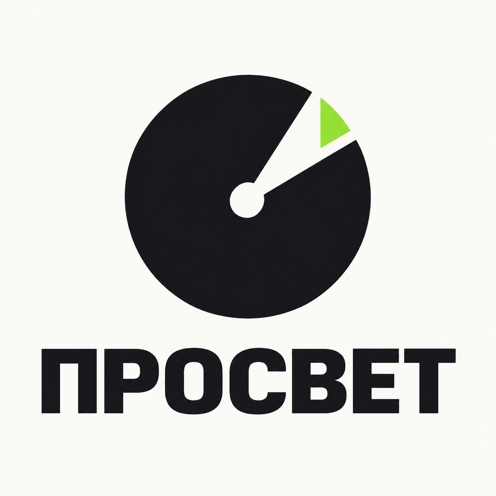
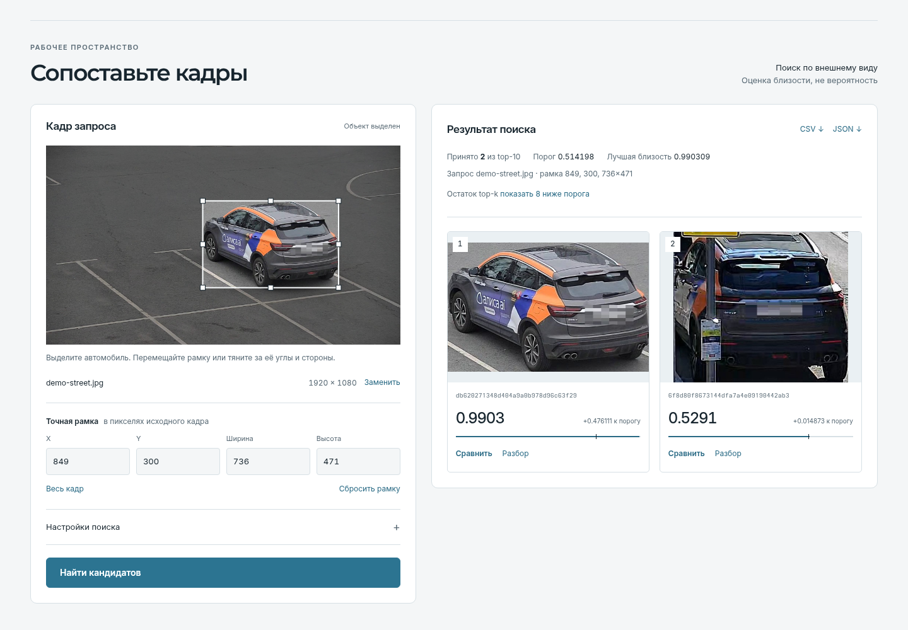
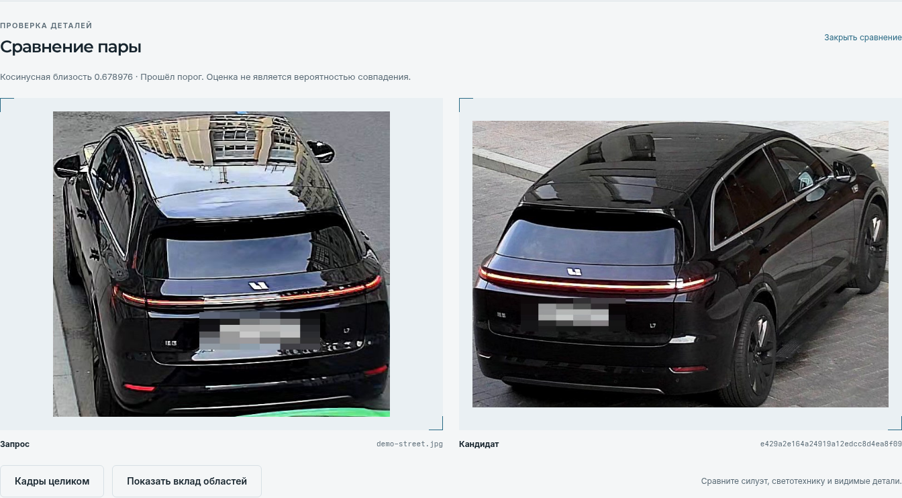
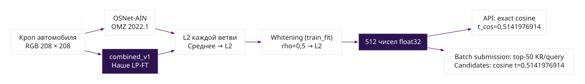

# Поиск автомобиля по кадру

**ЛЦТ 2026 · задача №7 «Фалькон Тех» · команда 33 «ПРОСВЕТ»**

Выделите автомобиль на снимке — сервис найдёт визуально похожие объекты в
галерее, покажет пару кадров для проверки и откажет, если близость ниже порога.
Номерной знак не используется как входной идентификатор. Модель получает весь
кроп автомобиля, поэтому полную независимость от области номера мы не заявляем.

**[Открыть работающий сервис](https://iamcp.ru/workspace/)** ·
[Посмотреть сайт проекта](https://iamcp.ru/) ·
[Прочитать документацию](https://iamcp.ru/submission/documentation.pdf) ·
[Открыть презентацию](https://iamcp.ru/submission/presentation.pdf)



*Реальный ответ HTTP-сервиса на разрешённый демонстрационный кадр, 28.09.2026.
На изображении показаны кандидаты, а не подтверждённая разметкой пара из
закрытого теста. Близость — косинусная оценка, не вероятность совпадения.*

## Что можно проверить

1. Открыть демо-кадр или загрузить JPEG/PNG и уточнить рамку автомобиля.
2. Выполнить настоящий поиск по галерее из 750 объектов, сравнить кадры и
   посмотреть разбор. При низкой близости сервис показывает отказ.
3. Скачать CSV или JSON именно для текущего результата. Интерфейс работает в
   светлой и тёмной темах, в том числе на узком экране.



*Проверка пары в живом сервисе: два разных исходных кадра. У демо-галереи нет
доступных нам меток идентичности, поэтому снимок не доказывает совпадение.
[Протокол кадра](04-solution/service/ui-checks/demo-example-20260928.md).*

Публичный сервис использует косинусный поиск. Пакетный расчёт ранжирует
каждый запрос независимо: k-reciprocal применяется только к его 50 ближайшим
по косинусу объектам статичной галереи. Отказ в `candidates.csv` и поиск в
HTTP-сервисе используют косинус и один порог. Эти шкалы нельзя смешивать.

## Модель и проверенные результаты

Сдаваемая **d1_j48** объединяет OSNet-AIN и дообученную нами `combined_v1`:
нормировка признаков → усреднение → whitening → нормировка. Выход — 512 чисел.
В пакетном режиме к ранжированию добавляется независимый k-reciprocal. Точная схема,
препроцессинг и пороги приведены в [SOLUTION.md](SOLUTION.md#methods).



[Открыть схему крупно](05-presentation/assets/pipeline.svg)

| Локальная проверка по опубликованному `evaluate.py` | mAP@10 | Rank-1 |
|---|---:|---:|
| Сдаваемое ранжирование: независимый top-50 k-reciprocal | **0,7411** | **0,7079** |
| Та же модель, только cosine | 0,7242 | 0,6851 |

Обе строки пересчитаны официальным `evaluate.py` на нашем уже многократно
использованном validation-сплите, а не на закрытом тесте: 1110 query × 750
gallery, 832 запроса с допустимой межкамерной парой. AP@10 нормируется на
`min(число допустимых совпадений, 10)`; запросы без пары не входят в mAP.
Косинусные `candidates.csv` с порогом 0,5141976914 дали на этом же сплите
F1 **0,9392** и TNR **0,7302** по официальному скрипту; порог выбран на
повторно использованной валидации, поэтому независимой оценки отказа нет.
Прежнее число **0,7741** относилось к исследовательскому KR на объединении
всех запросов и не описывает допустимую независимую сдачу. Распределение и
результат закрытого теста неизвестны. Протокол и границы — в
[§6 SOLUTION.md](SOLUTION.md#validation-metrics), хеши входов и точные значения —
в [машиночитаемом протоколе](04-solution/reproduce/evidence/official-validation-20260929.json).

Мы также обучили отдельное image→512D ядро. Оно быстрее в измеренной границе
«подготовленный тензор → дескриптор», но на том же официальном top-50
протоколе получило mAP@10 **0,2980** против **0,7411** у релиза. Эксперимент
и его ограничения сохранены [отдельно](04-solution/training/owncore-distill-20260926/REPORT.md);
сдаваемая модель остаётся d1_j48.

## Повторить решение

Это входной файл **`Readme.md` по ТЗ §12**. Подробные команды и условия находятся
в [SOLUTION.md](SOLUTION.md). На машине с NVIDIA GPU, Docker с доступом к GPU
и разрешённым комплектом данных основной образ собирается и запускается так:

```bash
docker compose -f 04-solution/service/docker-compose.yml up --build -d
```

Запуск поднимает API, Qdrant и однократный загрузчик галереи. Поиск становится
доступен после окончания загрузки; до этого ответ `409` ожидаем. Две ONNX-модели,
whitening входят в комплект. CUDA 12.2, cuDNN 9 и ONNX Runtime GPU устанавливаются
**во время сборки** образа; при запуске доступ в интернет не нужен. При запуске
основной образ требует CUDA и не переходит незаметно на CPU. Для машины без
NVIDIA есть отдельный [CPU-вариант](04-solution/service/README.md#cpu-run), который
собирается офлайн из включённых в комплект wheels и базовых образов. Данные
организатора передаются разрешённым способом отдельно от Git.

| Требование ТЗ §12 | Где раскрыто за один переход |
|---|---|
| Функциональная и компонентная архитектура | [§1: компоненты, код и взаимодействие](SOLUTION.md#architecture) |
| Методы обработки данных и алгоритмы | [§2: препроцессинг, модели, whitening, поиск и отказ](SOLUTION.md#methods) |
| Компиляция, сборка и установка; запуск одной командой | [§3: пошаговая подготовка](SOLUTION.md#build-install); [§4: сборка и запуск одной командой](SOLUTION.md#one-command) |
| Метрики на валидации | [§6: сплит, протокол, mAP, Rank-1/5, mINP, mAP@10](SOLUTION.md#validation-metrics) |
| Математическое или логическое обоснование порога отказа | [§6: целевая функция, формула F1, выбор порогов и ограничения](SOLUTION.md#refusal-threshold) |
| Все внешние библиотеки, фреймворки и датасеты с версиями | [§9: модели, датасеты, внешний код и версии/отпечатки](SOLUTION.md#external-resources); [§10: полный runtime и исследовательские среды, известные пробелы](SOLUTION.md#dependencies) |

CPU-резерв проверен на Podman и Docker Engine 29.7.2 / Compose V2 2.40.3
([отчёт](04-solution/audit/docker-path/README.md)). GPU-образ собран на Podman,
но инференс на RTX A5000 ещё не проверен. Для части исторических
обучающих окружений и внешних данных остаются пробелы происхождения и версий —
они перечислены в [§10](SOLUTION.md#dependencies), полное соответствие
воспроизводимости не заявляется.

## Материалы

[Формат выходных файлов](SOLUTION.md#submission-format) ·
[Команды воспроизведения](SOLUTION.md#reproduction) ·
[Manifest итогового прогона](04-solution/service/artifacts-final/README.md#воспроизведение) ·
[Развёртывание и откат](04-solution/service/deploy/README.md) ·
[Полная презентация PPTX](https://iamcp.ru/submission/presentation.pptx)

Сдаваемый код и артефакты размещены в
[репозитории команды в SourceCraft](https://sourcecraft.dev/lct-hackaton-2026/case-17-vehicle-digital-signature-team-33).
[Инструкция по развёртыванию и откату](04-solution/service/deploy/README.md)
описывает работающий образ и проверенный комплект данных. Исходники отдельного
ML-эксперимента также включены; его checkpoint и обучающие данные не входят в
релиз.

[ТЗ](00-task/tz.txt) · [Исследования](02-research/) ·
[Код решения](04-solution/) · [Презентация](05-presentation/README.md) ·
[План команды](03-plan/README-репозитория.md)
